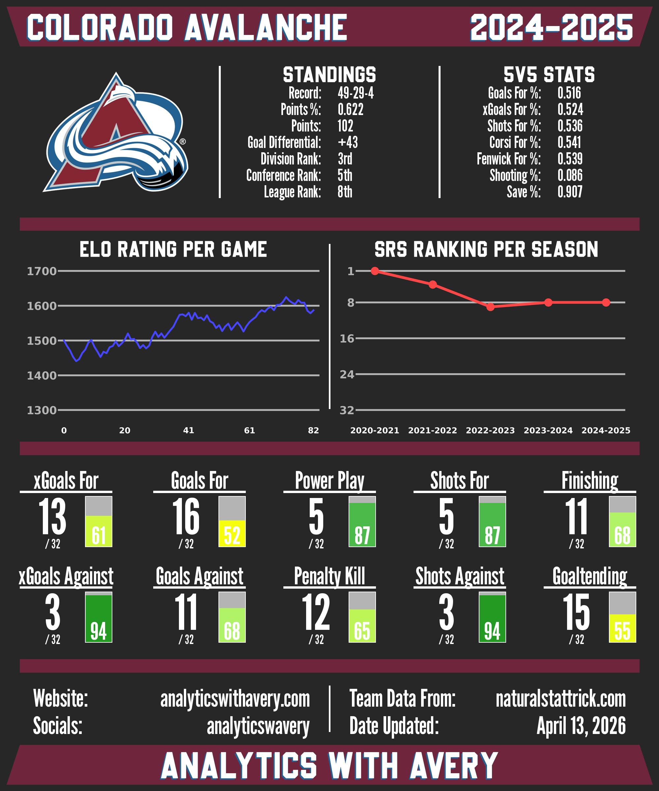

# NHL Team Stat Cards

## Description
An end-to-end data pipeline that scrapes NHL team information and statistics, calculates analytical metrics such as Elo and Simple Rating System (SRS) ratings, and generates visually appealing cards for each team.


### Features
* **Natural Stat Trick Scraping:** Collects NHL team statistics, standings, and game results.
* **Elo Ratings:** Calculates dynamic team strength ratings throughout the season using game results.
* **Simple Rating System (SRS):** Calculates team strength ratings by minimizing the difference between predicted and actual goal margins.
* **Card Data Assembly:** Aggregates team statistics and analytical metrics into structured datasets.
* **Team Card Generation:** Generates PNG cards featuring team logos, statistics, rankings, and analytical metrics.


<p align="center">
  
  <br />
  <em>Example team card.</em>
</p>


## Installation
### Prerequisites
* **Python 3.9+**
* **GTK+ Runtime** (Required for CairoSVG to render vector graphics to PNG)

### Setup
1. **Clone the repository:**

```bash
git clone https://github.com/AveryJD/project-nhl-team-cards.git
cd project-nhl-team-cards
```

2. **Create a virtual environment:**

```bash
python -m venv venv
source venv/bin/activate  # On Windows: venv\\Scripts\\activate
```

3. **Install dependencies:**

```bash
pip install -r requirements.txt
```


## Usage
The typical workflow is:
1. Scrape and clean raw data
2. Generate Elo and SRS ratings, and assemble card data
3. Generate visual team stat cards


### Step 1: Collect & Clean Data
This step scrapes and stores all raw data required for rankings and card generation.

Open utils/constants.py and set the seasons you want to process (in the format 'YYYY-YYYY', ex: '2024-2025'):
```python
# Seasons to scrape team data for
DATA_SEASONS = ['2024-2025', '2023-2024', '2022-2023', '2021-2022', '2020-2021', '2019-2020',
                '2018-2019', '2017-2018', '2016-2017', '2015-2016', '2014-2015', '2013-2014',
                '2012-2013', '2011-2012', '2010-2011', '2009-2010', '2008-2009', '2007-2008']
```

Execute the following script:
```bash
python src/collect_data.py
```

This script will:
* Scrape team logos from NHL.com (only needs to be collected once, so after the first run, this step can be commented out in src/collect_data.py)
* Scrape team statistics from Natural Stat Trick
* Scrape standings data from Natural Stat Trick
* Scrape game data from Natural Stat Trick
* Save all raw data locally for downstream processing

Note: Depending on the number of seasons, collecting data could take several minutes due to the implemented request delays to respect Natural Stat Trick’s servers.

All scraped data CSV files will be saved to the respective season folder in the 'data/team_card_data' folder, and team logo SVGs will be saved to the 'data/assets/team_logos' folder.


### Step 2: Generate Analytics and Card Data
This step transforms raw data into team rankings and structured card-ready datasets.

Open utils/constants.py and set the seasons you want to process (Natural Stat Trick's earliest season is 2007-2008):
```python
# Seasons to scrape team data for
DATA_SEASONS = ['2024-2025', '2023-2024', '2022-2023', '2021-2022', '2020-2021', '2019-2020',
                '2018-2019', '2017-2018', '2016-2017', '2015-2016', '2014-2015', '2013-2014',
                '2012-2013', '2011-2012', '2010-2011', '2009-2010', '2008-2009', '2007-2008']
```

Execute the following script:
```bash
python src/prepare_data.py
```

This script will:
* Generate Elo rating history for all teams across each season
* Generate SRS ratings for all teams across each season
* Assemble all team data required for card generation

Generated team Elo history files will be saved to the 'elo' folder in the respective season folder in the 'data/team_card_data' folder, SRS ratings will be saved to the respective season folder in the 'data/team_card_data', and card data CSV files will be saved to the 'data/team_card_data/card_data' folder.


### Step 3: Generate Cards
Once rankings and card data are prepared, this step generates visual team stat cards.

Call functions in src/generate_cards.py to choose what cards to generate:
```python
# Different functions for generating team cards:
card_generation.make_team_card('Colorado Avalanche', '2024-2025', 'dark')
card_generation.make_all_team_cards('2024-2025', 'light')
```

Available card generation options include:
* Single team cards
* All team cards in a season

Execute the following script:
```bash
python src/generate_cards.py
```

Generated card PNGs will be saved to the 'team_cards' folder.

## License
This project is licensed under the GNU General Public License v3.0. See the LICENSE file for details.


## Acknowledgments
* Data sourced from [Natural Stat Trick](https://www.naturalstattrick.com) and the NHL API.
* Project inspiration: [HockeyStats.com](https://hockeystats.com/cards/team-cards) & [RonoHockey](https://ronohockey.com/cards/teams/single-season/).


## Disclaimer
This project is for educational and analytical purposes and is not affiliated with the NHL.
