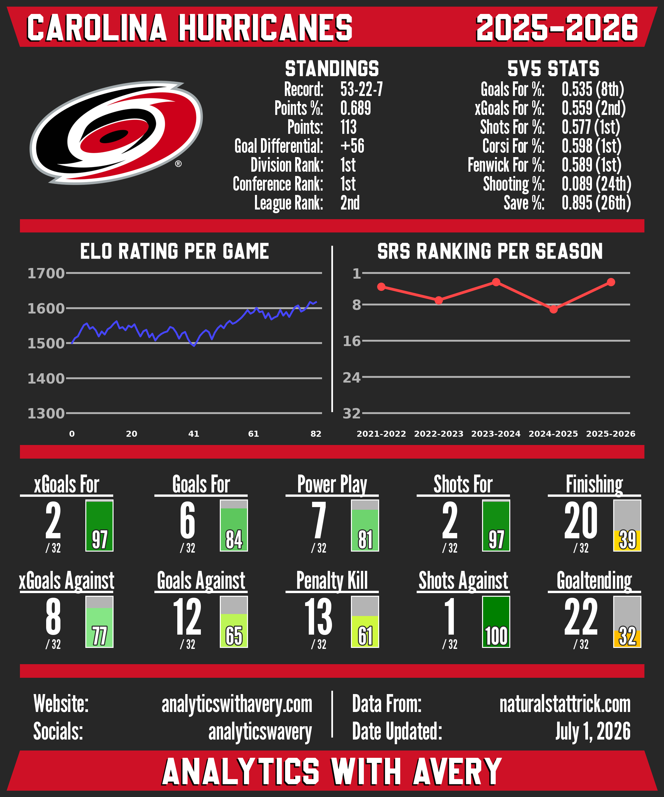

# NHL Team Stat Cards

## Description
An end-to-end data pipeline to scrape NHL team information and statistics, calculate analytical ratings such as Elo and Simple Rating System (SRS), and generate visually appealing cards for each team.

### Features
* **Natural Stat Trick Scraping:** Retrieves team statistics, standings, and game results directly from Natural Stat Trick.
* **Elo Ratings:** Calculates dynamic team strength ratings throughout the season using game results.
* **Simple Rating System (SRS):** Calculates team strength ratings by minimizing the difference between predicted and actual goal margins.
* **Card Data Assembly:** Aggregates team statistics, standings, and analytical ratings into structured datasets optimized for visualization.
* **Team Card Generation:** Generates PNG stat cards, including team logo, branding, standings, 5v5 stats, attribute rankings, percentile bars, and multi-season Elo/SRS trend graphs.

<p align="center">
  
  <br />
  <em>Example team card.</em>
</p>


## Installation
### Prerequisites
* **Python 3.9+**
* **GTK+ Runtime** (Required for CairoSVG to render vector graphics to PNG)

### Setup
1. **Clone the repository:**

```bash
git clone https://github.com/AveryJD/project-nhl-team-cards.git
cd project-nhl-team-cards
```

2. **Create a `data` folder in the project root:**

```bash
mkdir data
```

This folder is where all scraped/processed data and assets get saved, and constants.py locates the project root by searching upward for it.

3. **Create a virtual environment:**

```bash
python -m venv venv
source venv/bin/activate  # On Windows: venv\\Scripts\\activate
```

4. **Install the package (and its dependencies):**

```bash
pip install -e .
```

A requirements.txt is also included if it is prefered to install from that directly

```bash
pip install -r requirements.txt
```


## Usage
The typical workflow is:
1. Scrape raw data
2. Generate Elo and SRS ratings, and assemble card data
3. Generate visual team stat cards


### Step 1: Collect Data
This step scrapes and stores all raw data required for ratings and card generation.

Open src/team_card_project/constants.py and set the seasons you want to process (Natural Stat Trick's earliest season is 2007-2008, in the format 'YYYY-YYYY', ex: '2024-2025'):
```python
# Seasons to scrape, process, and generate cards for
DATA_SEASONS = ['2007-2008', '2008-2009', '2009-2010', '2010-2011', '2011-2012',
                '2012-2013', '2013-2014', '2014-2015', '2015-2016', '2016-2017',
                '2017-2018', '2018-2019', '2019-2020', '2020-2021', '2021-2022',
                '2022-2023', '2023-2024', '2024-2025', '2025-2026']
```

Execute the following script:
```bash
python -m team_card_project.collect_data
```

This script will:
* Scrape team logos from NHL.com (only needs to be collected once, so after the first run, this step can be commented out in src/team_card_project/collect_data/__main__.py)
* Scrape team statistics from Natural Stat Trick, for all situations
* Scrape standings data from Natural Stat Trick
* Scrape game data from Natural Stat Trick
* Save all raw data locally for downstream processing

All scraped data CSV files will be saved to the respective season's 'scraped_data' folder in 'data/team_card_data', and team logo SVGs will be saved to the 'data/assets/team_logos' folder.

Note: Depending on the number of seasons, collecting data could take several minutes due to the implemented request delays to respect Natural Stat Trick's servers.


### Step 2: Generate Analytics and Card Data
This step transforms raw data into team Elo/SRS ratings and structured card-ready datasets, using the same DATA_SEASONS set in Step 1.

Execute the following script:
```bash
python -m team_card_project.process_data
```

This script will:
* Generate Elo rating history for all teams across each season
* Generate SRS ratings for all teams across each season
* Assemble all team data required for card generation

Generated Elo and SRS rating files will be saved to the respective season's 'ratings' folder in 'data/team_card_data', and card data CSV files will be saved to the 'data/team_card_data/card_data' folder.


### Step 3: Generate Cards
Once ratings and card data are prepared, this step generates visual team stat cards.

Call functions in src/team_card_project/generate_cards/__main__.py to choose what cards to generate:
```python
card_generation.make_team_card('Colorado Avalanche', '2025-2026', 'dark')

"""
Parameters:
  Team Full Name ('Location Name')
  Season ('YYYY-YYYY')
  Card Mode ('Light' or 'Dark')
"""
```

Execute the following script:
```bash
python -m team_card_project.generate_cards
```

Generated card PNGs will be saved to the 'team_cards' folder.


## License
This project is licensed under the GNU General Public License v3.0. See the LICENSE file for details.


## Acknowledgments
* Data sourced from [Natural Stat Trick](https://www.naturalstattrick.com) and the NHL API.
* Project inspiration: [HockeyStats.com](https://hockeystats.com/cards/team-cards).


## Disclaimer
This project is for educational and analytical purposes and is not affiliated with the NHL.
